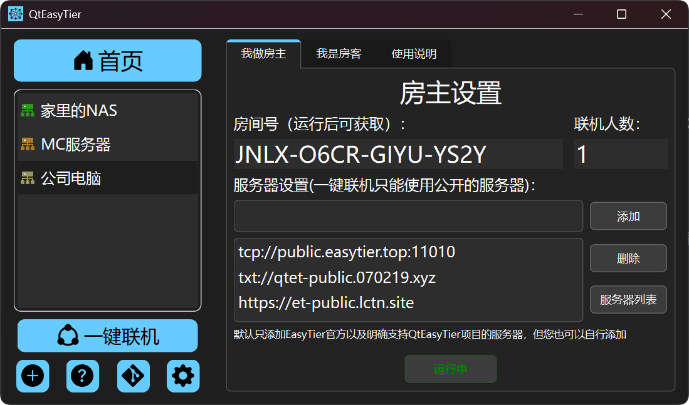
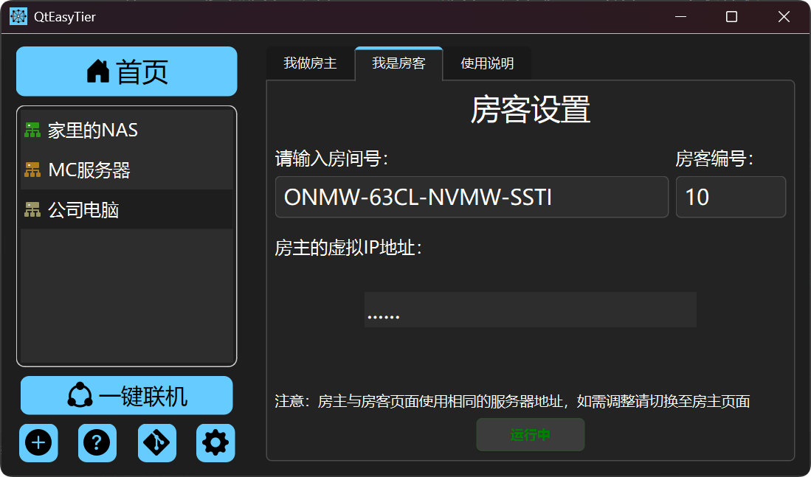

:::tip
一键联机需要占用55666端口作为RPC端口，请确保该端口空闲。
:::

一键联机是QtEasyTier1.1.0版本新增的特色功能，旨在帮助用户（特别是联机游戏玩家）快速开启联机，而无需复杂的组网知识与操作。

### 视频教程

  <iframe
    style="position: absolute; width: 100%; height: 100%; top: 0; left: 0;"
    src="//player.bilibili.com/player.html?isOutside=true&aid=116040436619021&bvid=BV1QvcgzAEAM&cid=35937584991&p=1"
    frameborder="0"
    framespacing="0"
    allowfullscreen="true">
  </iframe>

## 房主操作

1. 点击我做房主页面，默认添加有几个公益的服务器。
2. 【可选】你也可以修改服务器列表，可以点击服务器列表按钮查看并添加本软件收录的一些公共服务器，也可以自己输入添加。
3. 点击开始联机按钮，程序会自动生成随机的房间号并实时显示联机人数。
4. 将房间号发给你的好友，他人可通过房间号加入房间。
5. 【可选】你可以为你的房客编号（数字为1-253，自行约定，不可重复），房客使用固定的编号加入组网会获得固定的IP地址，以适配部分依赖客户端IP的联机游戏或Mod

## 房客操作

1. 点击我是房客页面，输入房主给你的房间号，点击开始联机按钮即可联机。
2. 【可选】你可以输入房主与你约定好的房客编号以固定IP地址
3. 联机成功后将显示房主的虚拟IP地址，在游戏界面内使用该地址即可与房主联机。

