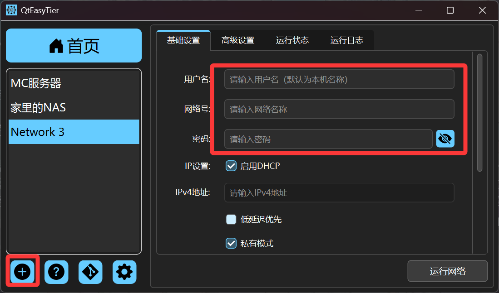
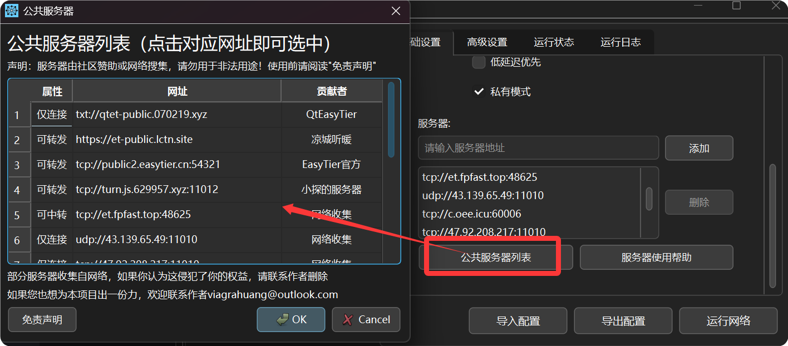
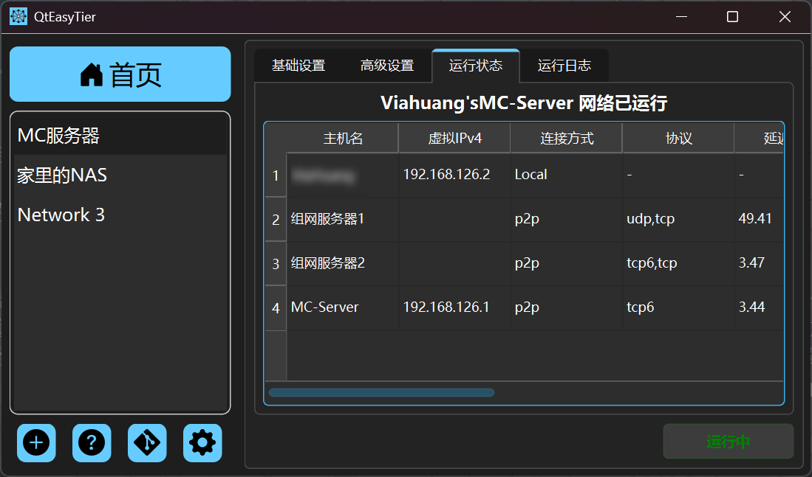

如果你是第一次使用本项目，且没有接触过 EasyTier 相关工具, 这个部分可以帮助你快速上手使用，轻松组建你的虚拟网络。

### 创建网络配置

#### 用户名与账密

- 打开后，你会看到主界面，点击左下角的加号创建一个新的网络配置
- 如果你想创建一个网络，在网络配置窗口中输入用户名（非必须，默认为主机名）、网络号、密码等基本信息，相同的网络号和密码在连接有共同的节点（服务器）时，即可组成虚拟网络网络。

:::caution
  - 注意：网络号和密码是他人加入组网的凭证，请尽可能设置复杂，务必妥善保管
:::

#### 添加服务器地址

- 服务器地址：默认已经预置了et官方的公共服务器地址，你可以直接使用，也可以添加其他服务器地址，支持多服务器。此外，本软件内置了一个公共服务器地址列表，可以一键添加

:::tip
- 该列表并非实时更新，可能部分服务器地址已失效。
- 前往[此处](/servers/public-servers-list)查看服务器列表的不定期更新。
:::

  - 服务器地址的格式一般为 ：协议://地址:端口号，如默认的官方服务器所示，协议一般填tcp或者udp。
  - *有关服务器的更多信息请前往[服务器说明](/servers/server-instruction)*

- 然后，您就可以点击 "运行网络" 按钮启动网络连接，在运行状态窗口可以查看加入网络的节点列表。

- 如果出错，可以在运行日志窗口查看错误信息，进行排查和解决。
- 此外，QtEasyTier允许你创建多个网络配置，每个网络配置可以独立运行，互不干扰，再您了解更多EasyTier的相关知识后，您可以根据需要在高级设置页面自定义网络配置，实现更多功能。

## 开机自启与网络自动连接

- 如果你的组网配置需要长期在线，建议在设置页面将QtEasyTier设置为开机自启，同时开启自动连接，这样在开机后即可自动加入网络。

:::tip
注意：便携版为了不污染系统环境，不支持设置开机自启
:::

> 当前版本中，“自动运行上次关闭前未退出的网络”已更名为“自动回连”

- 设置自动回连后，UI页面启动前，QtEasyTier会自动尝试连接已保存的网络配置，这个过程会花费一定时间，请耐心等待。此外，开机自启时，QtEasyTier会在后台运行，在任务栏中找到QtEasyTier的图标，点击右键选择“显示主界面”即可查看运行状态。
