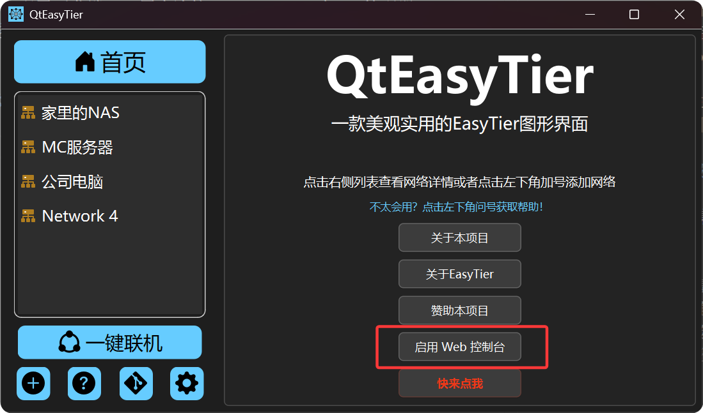
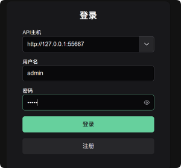
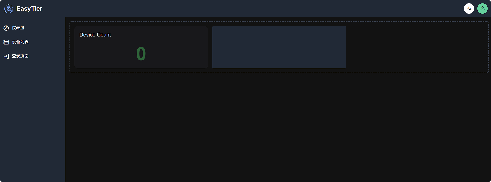
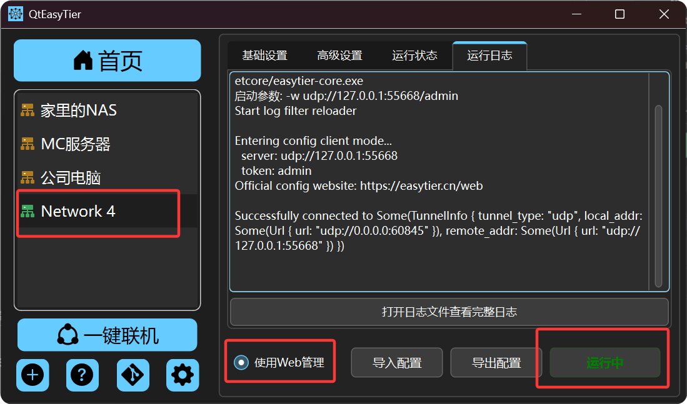

自 QtEasyTier 1.2.0 版本开始，允许用户使用 EasyTier 官方的 Web 管理器来管理节点，以下是具体操作步骤。

:::tip
Web管理器需要占用以下端口：
- 55667: API端口，用于网页启动以及连接Web管理器后端。
- 55668：配置下发端口，用来连接easytier-core与Web管理器。
请保证这两个端口空闲！
:::

### 启动 Web 管理器

在首页找到“启动 Web 管理器”按钮，点击即可启动Web管理器。 
然后程序会自动使用浏览器打开Web管理界面。 
当然您也可以输入`http://127.0.0.1:55667`手动打开。

打开Web管理界面后，会要求您进行登录，请使用用户名`admin`进行登录，默认密码为`admin`，登录后，您可以自行修改密码。

### 配置网络连接到 Web 管理器

:::caution
在一台设备中，只能有一个网络配置连接到 Web 管理器，否则可能会导致一些奇怪的问题。
:::

在 QtEasyTier中，新建一个网络配置，勾选右下角的“使用 Web 管理”按钮，然后点击运行网络即可。

:::tip
使用Web管理时，该网络配置的设置页面以及运行状态无效，请在Web管理器中进行配置与查看。
:::

更多有关Web管理器的使用操作，请参考[EasyTier 官网文档](https://easytier.cn/guide/network/web-console.html)。