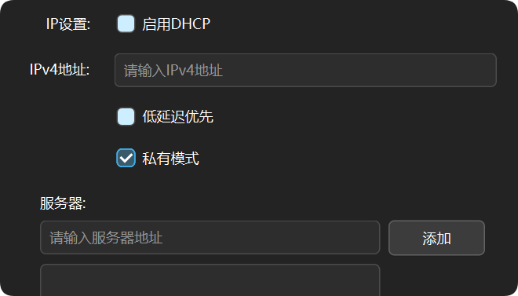
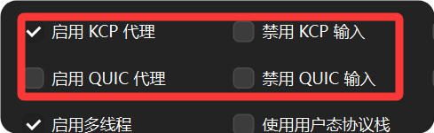

如果您觉得使用公共节点不甚满意，不妨来试试部署个人的服务器节点。

## 前提要求：

- 一台拥有公网IP地址的服务器(电脑)，EasyTier占用极低，几乎不影响服务器的正常运行。

:::tip
- 除了服务器外，也可以使用能部署EasyTier的云资源，比如Docker，雨云云应用等。
- 这种部署方法将会在后文部署公共服务器时介绍。
:::

## 使用 Windows 系统（带图形化界面）的服务器

前文提到，EasyTier 是不区分服务端和客户端的，因此，在有图形化界面的服务器上部署 EasyTier 服务器可以直接使用 QtEasyTier。

**作为“个人服务器”的节点应该具有以下特点：**
1. 能够被自己网络中其他设备连接并中转流量。
2. 一般情况下，不获取虚拟IP地址，相当于不参与这个组网。
3. 不能被其他人的网络连接，只给自己使用。

按照以上思路，我们很容易配置出一个符合要求的“服务器”节点。



- 在基础设置中，把DHCP关闭，并且不指定IP地址，这样在运行时就不会为该节点分配IP，满足条件2。
- 开启私有模式，并设置相应的网络号和密码，这样就只有使用相同网络号和密码的设备才能连接到该节点，满足条件1,3。

- 由于有公网直连且不参与组网，高级设置中大部分选项无意义，可以保持默认值。
- 但KCP和QUIC的开关可以按需打开，这决定服务器是否接受KCP/QUIC协议的流量。



- 在监听端口处选择一个未被占用的端口，比如11010。并按以下格式填好地址：

```
协议://0.0.0.0:端口号
```
> 协议可以选择`tcp`, `udp`, `ws`(WebSocket), `wss`(WebSocket over TLS), `wg`(WireGuard)，根据实际情况选择。
> 如果你不知道怎么选，保持默认的tcp和udp即可

:::tip
- 0.0.0.0 表示监听所有网络接口，这是为了确保服务器可以接受来自任何网络的连接。
- 此处不能填127.0.0.1或localhost，这会导致服务器只能接受本地连接，无法接受来自其他网络的连接。
:::

以上所述内容都设置好后，点击“开始运行”即可运行该“服务器”节点。
他人可以使用该服务器的公网IP+端口号来连接该节点。

:::tip
记得在防火墙或服务器安全组开放对应的监听端口和协议
:::

## 使用Linux系统（无图形化界面）的服务器

> 此处所述方法是通过直接下载EasyTier的二进制文件来部署，而非使用Docker。

===待更新===
