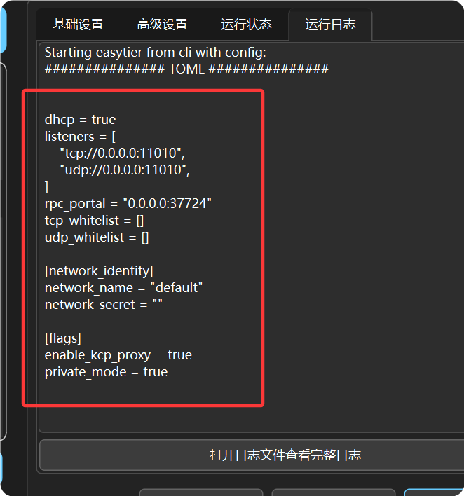

:::tip
本篇文档使用 GUI 和 命令行+配置文件 两种方式部署个人服务器节点。
如需使用其他方式部署请参考[部署公共服务器](/servers/deploy-public)。
:::

如果您觉得使用公共节点不甚满意，不妨来试试部署个人的服务器节点。

## 前提要求：

- 一台拥有公网IP地址的服务器(电脑)，EasyTier占用极低，几乎不影响服务器的正常运行。

---

## 使用 Windows 系统（带图形化界面）的服务器

前文提到，EasyTier 是不区分服务端和客户端的，因此，在有图形化界面的服务器上部署 EasyTier 服务器可以直接使用 QtEasyTier。

**作为“个人服务器”的节点应该具有以下特点：**
1. 能够被自己网络中其他设备连接并中转流量。
2. 一般情况下，不获取虚拟IP地址，相当于不参与这个组网。
3. 不能被其他人的网络连接，只给自己使用。

按照以上思路，我们很容易配置出一个符合要求的“服务器”节点。


- 在基础设置中，把DHCP关闭，并且不指定IP地址，这样在运行时就不会为该节点分配IP，满足条件2。
- 开启私有模式，并设置相应的网络号和密码，这样就只有使用相同网络号和密码的设备才能连接到该节点，满足条件1,3。

- 由于有公网直连且不参与组网，高级设置中大部分选项无意义，可以保持默认值。
- 但KCP和QUIC的开关可以按需打开，这决定服务器是否接受KCP/QUIC协议的流量。


- 在监听端口处选择一个未被占用的端口，比如11010。并按以下格式填好地址：

```
协议://0.0.0.0:端口号
```
> 协议可以选择`tcp`, `udp`, `ws`(WebSocket), `wss`(WebSocket over TLS), `wg`(WireGuard)，根据实际情况选择。
> 如果你不知道怎么选，保持默认的tcp和udp即可

:::tip
- 0.0.0.0 表示监听所有网络接口，这是为了确保服务器可以接受来自任何网络的连接。
- 此处不能填127.0.0.1或localhost，这会导致服务器只能接受本地连接，无法接受来自其他网络的连接。
:::

以上所述内容都设置好后，点击“开始运行”即可运行该“服务器”节点。
他人可以使用该服务器的公网IP+端口号来连接该节点。

:::tip
记得在防火墙或服务器安全组开放对应的监听端口和协议
:::
---

## 使用Linux系统（无图形化界面）的服务器

> 此处所述方法是通过直接下载 EasyTier 官方的二进制文件，通过配置文件来部署，而非使用Docker。

### 下载 EasyTier 命令行程序

1. **手动下载命令行程序**
  [命令行程序地址](https://github.com/EasyTier/EasyTier/releases)
  [GitHub加速](https://gh-proxy.org/)
  - 首先从[命令行程序地址](https://github.com/EasyTier/EasyTier/releases)中根据自身设备硬件架构获取对应版本easytier cli程序
  - 接着将GitHub加速链接拼接到easytier程序下载链接前，构成如下加速下载链接：
    https://gh-proxy.org/https://github.com/EasyTier/EasyTier/releases/download/v2.5.0/easytier-linux-x86_64-v2.5.0.zip
  - 使用以下命令检测easytier内核版本

```bash [Linux / MacOS / FreeBSD]
   ./easytier-core --version
```

:::tip
- EasyTier国内临时下载地址：https://easytier.nkbpal.cn/
- 此外，您也可以从QtEasyTier的安装包的etcore文件夹中提取easytier-core程序（目前仅Windows）。
:::

2. **一键安装脚本（仅 Linux）**

   注意：一键脚本依赖 `unzip`，请提前下载并安装。

```bash
   # 安装unzip (Debian)
   sudo apt install unzip

   wget -O /tmp/easytier.sh "https://raw.githubusercontent.com/EasyTier/EasyTier/main/script/install.sh" && sudo bash /tmp/easytier.sh install --gh-proxy https://ghfast.top/
```

   脚本执行成功后，EasyTier 的二进程程序会安装到 `/opt/easytier` 目录下，配置文件位于 `/opt/easytier/config/default.conf`。

   EasyTier 会被注册为系统服务，可以通过以下命令管理：

```bash
   systemctl start easytier@default     # 启动
   systemctl stop easytier@default      # 停止
   systemctl status easytier@default    # 查看状态
   systemctl restart easytier@default   # 重启
```
> **不建议**手动更改一键安装脚本中的github加速链接！
> 一键安装脚本安装失败后重试请**先删除**/opt目录下的/easytier文件夹！
> 一键安装脚本仅支持安装**稳定版**，Pre-release版本仅支持手动安装！

3. **(可选)安装 Shell 补全功能**

```fish
   # Fish 补全
   easytier-core --gen-autocomplete fish > ~/.config/fish/completions/easytier-core.fish
   easytier-cli gen-autocomplete fish > ~/.config/fish/completions/easytier-core.fish
```

### 生成配置文件

接下来，按照 EasyTier 的配置文件格式编写 toml 配置文件。
  - 使用一键安装脚本安装的et，请直接修改 `/opt/easytier/config/default.conf` 配置文件。
  - 手动下载的et，请自行找一个目录存放配置文件，建议放在easytier-core所在目录附近。

1. 配置文件可通过 [配置文件生成器](https://easytier.cn/web/index.html#/config_generator) 生成。
  > 临时配置文件生成（暂时选项不全）：https://easytier.nkbpal.cn/easytier.html

2. 如果配置文件生成器不可用，你也可以在 QtEasyTier 中新建一个组网，按 GUI 的步骤配置好后点击一次运行，然后在日志中找到如图所示的内容即为配置文件内容。



:::caution
不可使用 QtEasyTier 中导出的 json 配置文件，与 ET 官方的 toml 配置文件格式不同。
:::

3. 这里给出一份可用的配置文件示例：

```toml
hostname = "明月清风"   # 节点名称，可自定义
dhcp = false
listeners = [
    "tcp://0.0.0.0:11010",
    "udp://0.0.0.0:11010",
] # 监听端口，可自定义

[network_identity]
network_name = "你的网络名称"
network_secret = "你的网络密钥"

[flags]
latency_first = true   # 低延迟模式
private_mode = true    # 私有模式
```

### 启动 EasyTier 节点

对于使用一键安装脚本安装的et，直接使用以下命令即可启动 EasyTier 节点：
```bash
   systemctl start easytier@default
```

对于手动安装的core，使用以下命令即可启动 EasyTier 节点：
```bash
   ./easytier-core -c /path/to/your/config.toml
```

然而，当你关闭终端后，EasyTier 会被杀死，因此我们需要将其注册到系统服务使其能够正常运行。
> 这里以使用 systemctl 的 Linux 系统为例

1. 创建 systemd 服务文件

```bash
   sudo nano /etc/systemd/system/easytier.service
```

2. 编辑服务文件

```ini
[Unit]
Description=EasyTier Service
# 确保在网络完全在线后再启动
After=network.target network-online.target syslog.target
# 明确要求网络在线
Wants=network.target network-online.target

[Service]
Type=simple
ExecStart=/path/to/your/easytier-core -c /path/to/your/config.toml
Restart=always
RestartSec=3s
StartLimitIntervalSec=0

[Install]
WantedBy=multi-user.target
```

3. 启用并启动服务

```bash
   sudo systemctl enable easytier.service
   sudo systemctl start easytier.service
```

**至此，如果不出意外，EasyTier 服务器节点应该已经成功启动了。**

