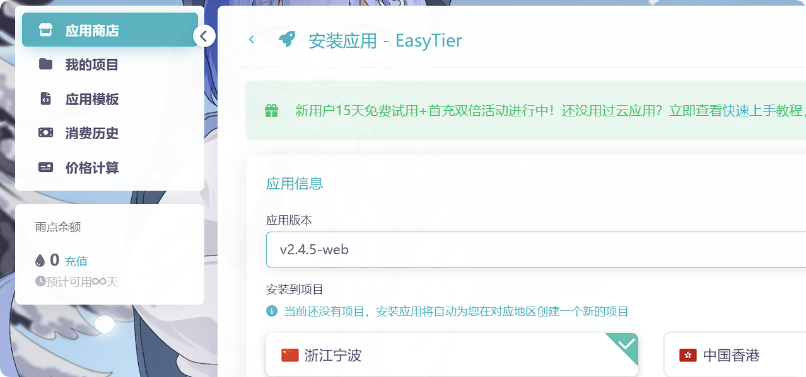
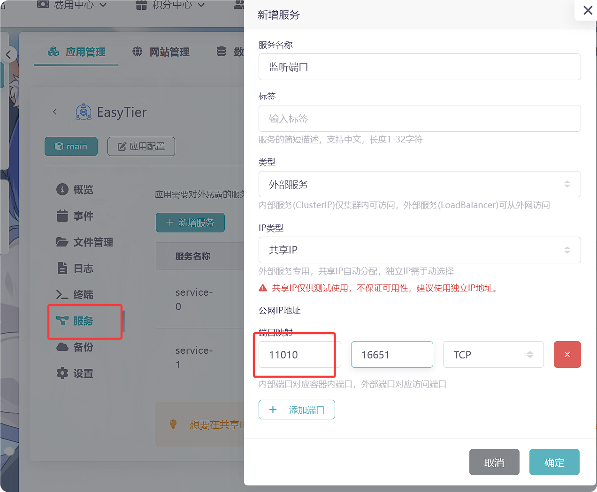
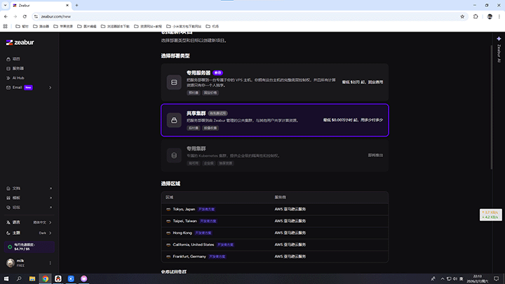
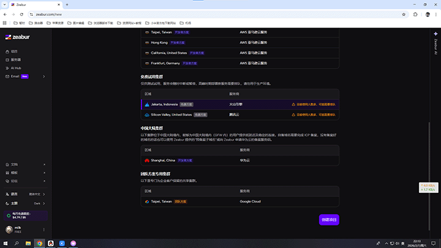
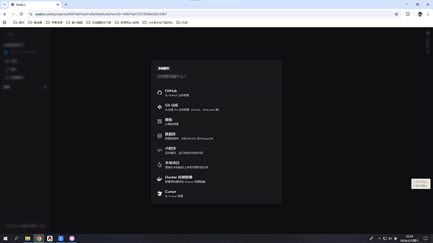
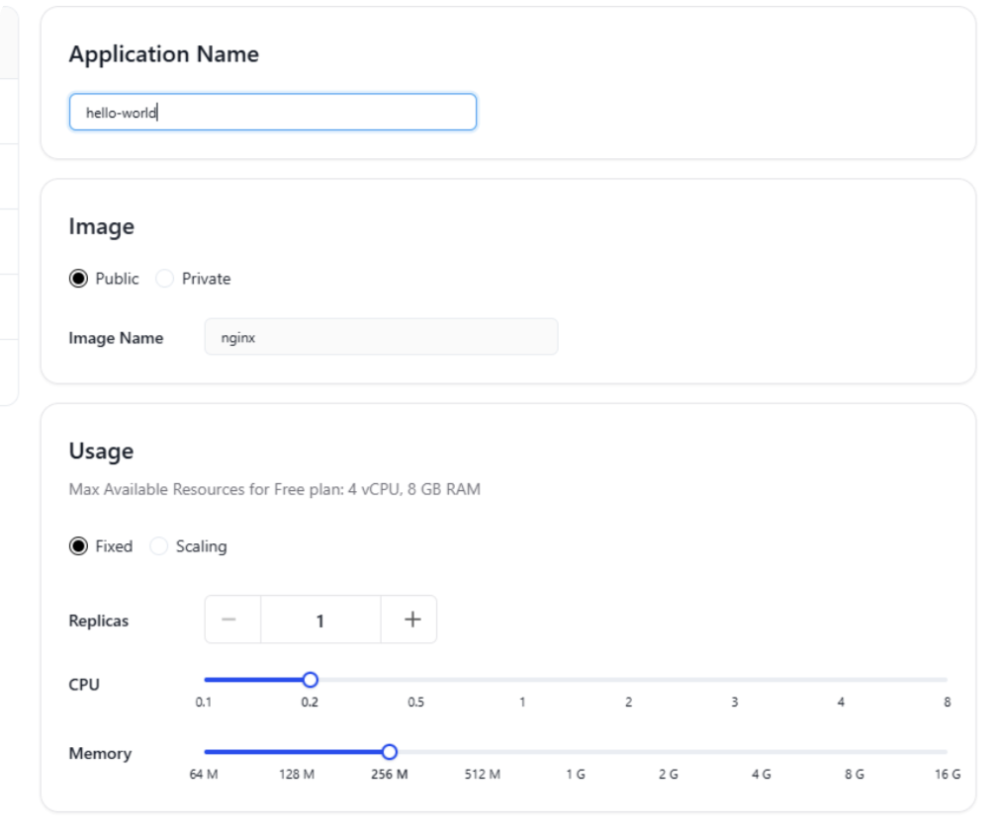
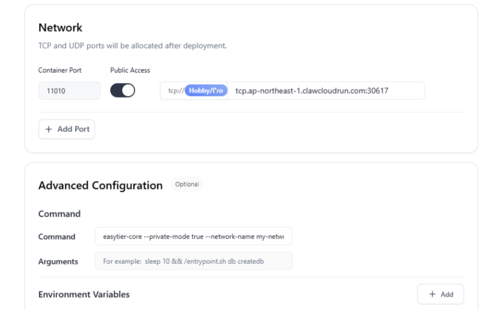

:::tip
本篇文档使用 容器化部署+参数启动 的方式部署公共服务器节点。
如需使用其他方式部署请参考[部署个人服务器](/servers/deploy-personal)。
:::

## 使用雨云云应用

> 在本节中，将会以雨云云应用为例，展示如何部署公共服务器。

1. 登录雨云云应用控制台，点击创建应用，在应用商店找到 QtEasyTier 应用，点击部署，选择最新的web版本，其他选项按需调整，一般默认即可。


2. 等待安装完成后，进入该应用的控制台。

3. 在控制台的终端中输入EasyTier的启动命令以及参数即可激动节点

当作为公共节点时，可以不加参数（默认使用11010端口监听），如需指定协议和端口，可以使用如下参数：

```bash
# 多个端口或协议时需分别指定
easytier-core --listeners tcp://0.0.0.0:11010 --listeners xxxxxx
```

如果想要服务器只帮助建立P2P连接而不转发数据，可以通过开启转发 RPC 和 开启网络白名单实现。如果想要转发特定网络的数据，在白名单后接上对应的网络名即可

```bash
# 多个端口或协议时需分别指定
easytier-core --relay-all-peer-rpc --relay-network-whitelist xxxxxx
```

4. 根据你开放的端口和协议，在服务一栏中添加对应端口和协议。


他人使用对应的IP地址和端口即可连接到你的服务器节点。

5. 可选：添加定时任务

上述方法虽然能成功运行节点，但每次重启应用都要手动操作会比较麻烦，因此可以添加定时任务，使其自动启动节点。

  - 在实例的定时任务页面中点击添加任务名称任取，周期可以选半个小时或者一个小时左右。
  
  - 任务选shell，应用选择EasyTier，脚本输入以下内容。

```shell
#!/bin/bash

# 要检查的进程名（不包含参数）
PROCESS_NAME="easytier-core"
# 要执行的完整命令(这里替换为你实际要运行的命令)
FULL_COMMAND="easytier-core --listeners tcp://0.0.0.0:11010 --relay-all-peer-rpc --relay-network-whitelist xxxxxx"......

# 检查进程是否正在运行
# 使用 pgrep 查找进程，-x 表示精确匹配进程名
if pgrep -x "$PROCESS_NAME" > /dev/null
then
    echo "$(date): $PROCESS_NAME 正在运行，无需操作"
else
    echo "$(date): $PROCESS_NAME 未运行，正在启动..."
    # 启动命令，使用 nohup 和 & 在后台运行
    nohup $FULL_COMMAND > /dev/null 2>&1 &
    
    # 等待一秒检查是否启动成功
    sleep 3
    if pgrep -x "$PROCESS_NAME" > /dev/null
    then
        echo "$(date): $PROCESS_NAME 启动成功"
    else
        echo "$(date): $PROCESS_NAME 启动失败"
        exit 1
    fi
fi

exit 0
```

:::tip
该脚本会检查脚本是否运行，不会重复启动
:::

**至此，公共服务器节点就部署完成了。**

---

## 使用Docker部署（zeabur 和 claw）

:::tip
以下内容转载自 **候汝已久** 大佬的文章，有删改<br>
《使用免费的zeabur和claw搭建EasyTier私有节点
》
:::

- zeabur: [https://zeabur.cn](https://zeabur.cn)
- claw: [https://ap-northeast-1.run.claw.cloud](https://ap-northeast-1.run.claw.cloud)

前提是你有github账号，且注册满180天，这样容器平台会送你每个月5刀的余额.搭建EasyTier节点不转发流量完全够用，转发流量算了吧5刀也用不了多少流量，只建议拿来握手连接通p2p2 。NAT4拿来内网穿透 web那速度不敢恭维

### zeabur搭建方法

- 点击创建项目。


- 免费试用集群，选腾讯，延迟都是 100-300左右，然后创建项目。


- 点部署新服务，点Docker容器镜像。


- 配置好对应选项
  - docker镜像填easytier/easytier
  - 端口填你开放你监听端口
  - 启动命令参照上文

**引用官方文档的解释**

如果你希望 EasyTier 仅在你的虚拟网络中提供服务，而不希望其他虚拟网的节点连接到你的节点，可以使用 --private-mode true 参数启动 EasyTier。
这会仅允许网络名为 my-network 且密钥为 my-secret 的节点连接到该 EasyTier 节点。
> 其他启动参数[官方文档](https://easytier.cn)有写自己去看着改

启动成功就这样的

`tcp://sjc1.clusters.zeabur.com:33332`
会显示类似这样的链接 填入EasyTier的节点即可使用

### claw部署EasyTier节点

打开网站链接 [https://ap-northeast-1.run.claw.cloud](https://ap-northeast-1.run.claw.cloud)
使用github登录


点开App Launchpad

- 点开Create App
  - Applicatin NName: 填自己喜欢的名称
  - Image: 填官方docker镜像即可`easytier/easytier`
  - Usage: 就是cpu的频率和内存容量的设置, 给cpu 0.1 内存给64M即可, 这只是不转发流量的情况下够用, 根据实际需求调整配置
  - Network: 设置端口和域名的 可以添加自己的域名
  

> 这里calw免费计划的限制tcp/udp只能开放一个，https grpcs wss这三种协议没有限制

- Advanced  Confinguration
  - Command: 填启动命令
  ```bash
  easytier-core --xxxxxx
  ```
 

点Deploy Application创建容器即可
如果没启动成功就是镜像没拉取下来claw的老毛病
没解决办法 你换个地区试试 有新加坡 美国 日本这三个免费地区可以换

创建成功会显示
`tcp://tcp.ap-northeast-1.clawcloudrun.com:30655`
这样的链接

在服务器一栏中填上即可使用
