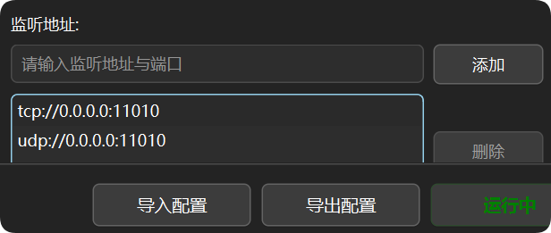
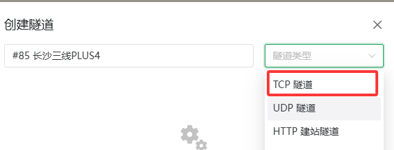
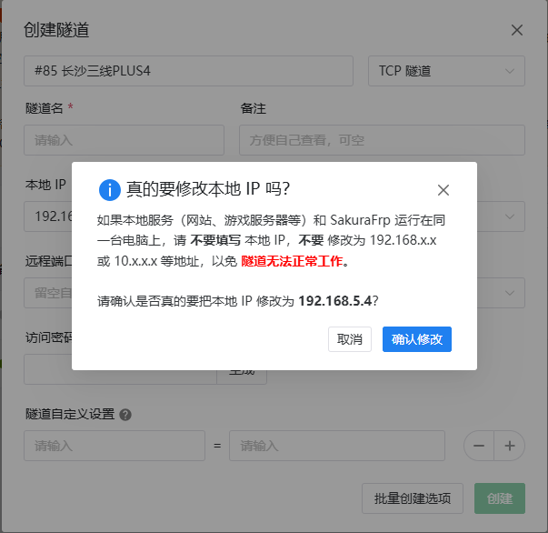
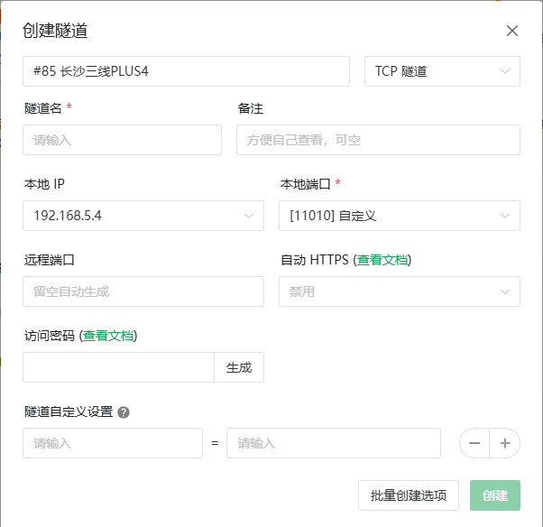
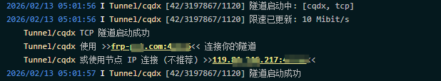
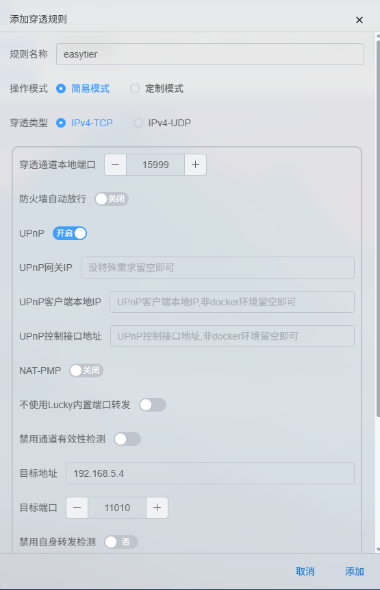
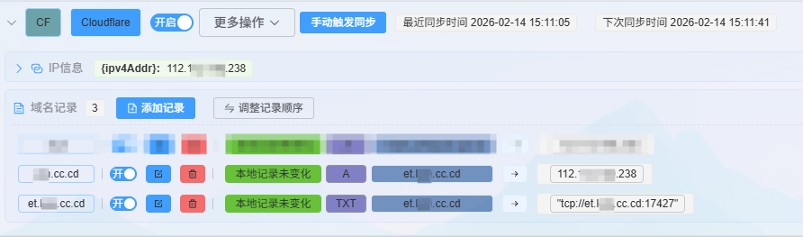
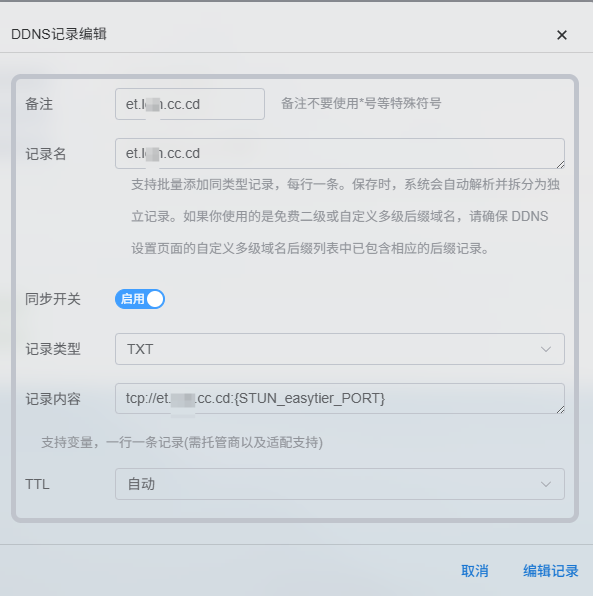
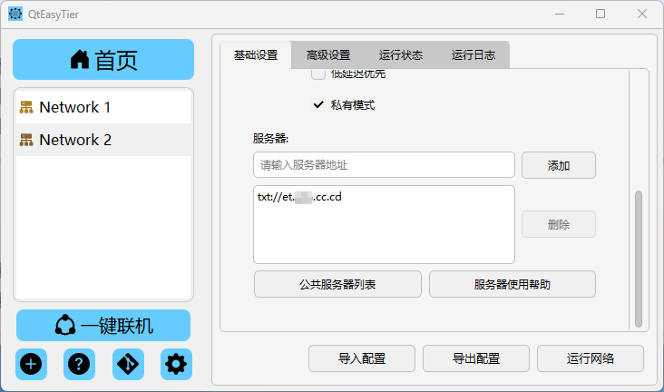

## 内网穿透技术

内网穿透是指将位于内网中的服务器的某些端口通过某种技术手段，映射到公网上，使得公网中的客户端可以访问到内网中的服务器。

目前常用的技术有`Frp`、`Ngrok`等，它们通过在公网服务器上搭建代理服务，将公网流量转发到内网中的服务器，实现内网穿透。当然，如果您的NAT类型为**NAT1**（完全锥形NAT），则可以使用`STUN`协议实现内网穿透。

:::tip
通过内网穿透搭建服务器需要修改本地IP为**局域网IP**（127.0.0.1等本地地址会导致组网无法连接）！！！
NAT1（完全锥形NAT）是指NAT设备对所有来自同一内网IP的流量，都映射到同一个公网IP和端口。这样外部设备只需要知道公网IP和端口，就可以访问到内网中的服务器，这是STUN协议的基础。
:::

下面，我们分别介绍这两种技术的搭建过程，代理服务器以`SakuraFrp`为例, STUN穿透以`Lucky`工具为例。

## 使用Frp搭建服务器节点

### 启动QtEasyTier

:::tip
此处也可以使用其他的 EasyTier 客户端或 `easytier-core` 命令行程序
:::

1. 根据需要配置好服务端的组网参数
2. 监听端口处可以按需填写，这里以默认的 11010 tcp 端口为例
3. 点击运行网络即可

### 创建FRP隧道

1. 打开FRP网站-注册-登陆-实名认证
2. 查看可选FRP节点状态
3. 创建FRP隧道
   由于运营商QOS以及节点设置，推荐优先选择TCP隧道

4. 修改本地IP为**局域网IP**（127.0.0.1等本地回环地址会导致组网无法连接）

:::tip
建议在路由器中设置服务器节点的静态IP，避免IP动态变化导致隧道失效
:::

5. 修改本地端口为你在QtEasyTier中配置的监听端口（默认为11010）

#### 节点选择建议

在选择穿透节点时，推荐按顺序考虑以下几点：

- 优先选择**同省**的**多线、三线**节点
- 若没有同省节点，优先选择**物理位置较近**的**多线、三线**节点
- 若没有多线、三线节点可选，优先选择**同运营商**节点，尽可能避免跨运营商访问。在此基础上，尽可能选择**物理位置较近**的节点
- 在没有其他选择的情况下，选择**离自己物理位置较近**的节点
- 特别的，对于广电用户，在没有三线、多线可选的情况下，请尝试**移动**或**联通**节点

### 启动FRP隧道

1. 根据设备下载合适的二次开发**启动器**或***frpc***

2. 配置启动器（根据引导操作，不详述）
3. 启动隧道
4. 查看FRP日志，从中获取FRP穿透地址及端口

5. 进行组网时，服务器一栏填写FRP穿透地址及端口即可

:::tip
使用代理服务器进行内网穿透搭建 EasyTier 服务器时，如果本机也要加入组网，建议同时运行两个配置，一个用作服务器节点，一个用作客户端节点连接该服务器。

因为穿透时，填入的是代理服务器的地址，其他设备连接本机时会从代理服务器转发流量，上限取决于代理服务器的带宽。而单独开一个配置作为客户端，其他设备就会尝试P2P打洞直连该节点，以提高传输速率。
:::

## 使用STUN搭建服务器节点

本部分内容基于[Lucky](https://lucky666.cn/)或其他STUN内网穿透软件实现，以下以Lucky为例。

### 功能介绍
STUN（Session Traversal Utilities for NAT）内网穿透技术可以帮助解决因NAT（Network Address Translation）技术所带来的网络连接问题。STUN技术允许**NAT1**用户获取公网端口，通过路由端口转发或者LUCKY内置转发，将内网服务端口暴露到外网，从而实现内网穿透的目的。

### 使用前需知
STUN功能提供的端口穿透仅用于体验，无法保证端口变化的频率。请注意，对于与STUN稳定性相关的问题，无法提供技术支持。同时，我们也不提供任何关于如何访问内网的无公网v4方案。

> STUN内网穿透基础使用说明详见[STUN内网穿透](https://lucky666.cn/docs/modules/stun)

### 实现步骤

> 服务端的启动方法与前文相同，不再赘述

1. 成功实现STUN内网穿透

   - 以下为参考配置：

2. 通过动态域名(DDNS)绑定家庭宽带公网Ipv4地址
3. 获取STUN内网穿透端口变化
   - （不推荐）[使用邮件通知端口变化情况](https://www.bilibili.com/read/cv34705222/?from=readlist&opus_fallback=1)
   - （推荐）[使用lucky-DDNS配置传递IP及端口变化](https://www.bilibili.com/read/cv41904858/?from=readlist&opus_fallback=1)
   - 通过HTML网页、使用Cloudflare的重定向规则等方法通知端口变化情况
4. 通过DNS的TXT记录传递IP及端口
   - 记录名称：要更新的域名
   - 选择记录类型：TXT
   - 记录内容：填写要添加到TXT记录中的内容 如：tcp://{STUN_规则名_ADDR}

   - 以下为参考配置：

> 优点：简单易行
> 缺点：DNS记录在全球范围内的传递需要时间，根据各地运营商DNS同步策略而定，一般不超过30分钟。

### 连接服务器
1. 将STUN穿透地址及端口填入服务器栏
2. 或将TXT记录填入服务器栏
2. 启动组网

:::tip
与Frp不同，STUN穿透相当于想办法将内网端口直接暴露到公网，上线取决于宽带速率，当需要将本机也加入组网时无需分离客户端和服务端。
:::