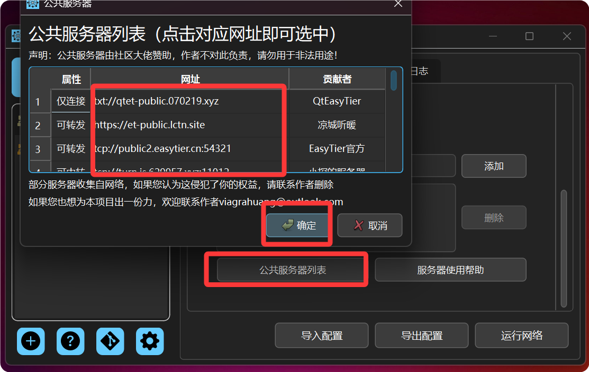

**服务器在QtEasyTier组网中的作用：**作为一款去中心化的组网软件，本质上EasyTier并不区分服务器与客户端。
但是，就目前而言，国内不是人人都拥有公网IP，这就导致你无法直接与他人的设备进行组网。
而服务器其实也可以说是一个公共的节点，与传统中心化组网的服务器不同，Et的公共节点更多的是帮助多个设备进行p2p连接组网。
设备加入网络后，并不依赖服务器维持网络的连接，只要和其中一个成员处于p2p连接状态，那么您的数据包就可以通过一定线路传递给网内成员。
也就是说，QtEasyTier(EasyTier)的公共服务器更多的是作为网络的“接入口”而非“维持者”。

## 加入公共服务器

QtEasyTier收集了一些社区大佬创建的公共服务器，你可以选择加入他们。

- 点击网络的基础设置界面中的公共服务器列表按钮
- 在弹出的界面中点击你想要添加的公共服务器地址，地址颜色变为天依蓝即为选中
  - “可转发”是指该服务器可作为中转服务器来转发数据包。
  - “仅连接”是指该服务器仅用于帮助节点建立p2p连接，不能转发数据包。
- 点击确定按钮，你选中的服务器会自动添加到服务器列表中

 
